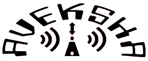
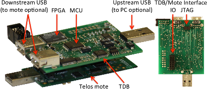

 

Aveksha is a hardware-software approach for non-intrusively tracing and profiling
sensor network nodes. It is particularly useful for in-field monitoring and debugging
of sensor network applications. The key is to exploit the capabilities of the JTAG
interface present on the sensor nodes application processor, to rapidly poll the
processors state and create a trace of events. The trace is augmented with
energy reading that can be correlated to the events. The hardware prototype we have
created is the Telos Debug Board (TDB). This board is capable of interfacing with the
JTAG port on a Telos (Rev B) mote. It can poll a watchpoint buffer or PC register of
the target processor, while at the same time taking energy readings of the mote.

Publications
------------

Aveksha: A Hardware-Software Approach for Non-intrusive Tracing and Profiling of
Wireless Embedded Systems: Matthew Tancreti, Mohammad Hossain, Saurabh Bagchi,
and Vijay Raghunathan. In: 9th ACM Conference on Embedded Networked Sensor Systems (SenSys),
14 pages, Seattle, Washington, November 1-4, 2011. (Acceptance rate: 24/123 = 19.5%)
[\[ Presentation \]](documents/presentation-aveksha-sensys2011.pdf)

Demo Abstract: Aveksha - A Hardware-Software Approach for Non-intrusive Tracing and Profiling of
Wireless Embedded Systems: Matthew Tancreti, Mohammad Hossain, Saurabh Bagchi,
and Vijay Raghunathan. In: 9th ACM Conference on Embedded Networked Sensor Systems (SenSys),
2 pages, Seattle, Washington, November 1-4, 2011.
