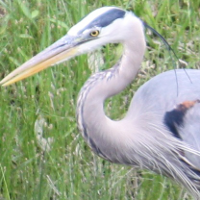

I like working on open source software and hardware, this site details some of my projects.

Updates
-------

*2011-08-22* Our paper [Aveksha: A Hardware-Software Approach for Non-intrusive Tracing and
Profiling of Wireless Embedded Systems](http://matthew.tancreti.net/aveksha.html)
has been accepted to appear at SenSys 2011 in Seattle, WA on Nov 1-4.
We will also be showing the Telos Debug Board in the demo session.
