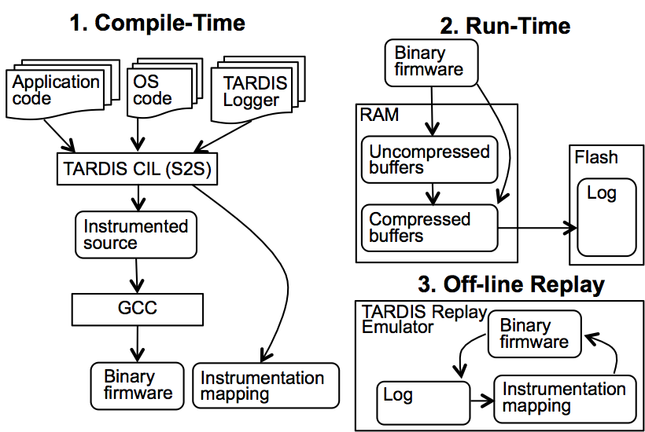

 

Trace And Replay Debugging In Sensornets (TARDIS) is a software approach for
system-level record and replay of embedded nodes, particularly in wireless
sensor networks. System-level means that it is able to replay a complete execution
down to individual insturctions. TARDIS is able to record all sources of
non-determinism, based on the observation that such information is compressible
using a combination of techniques specialized for respective sources. Despite their
domain-specific nature, the techniques presented are applicable to the broader class
of resource-constrained embedded systems.

Download
--------
The TARDIS runtime is [available on GitHub](https://github.com/mtancret/recordreplay) for non-commercial purposes.

Publications
------------

Matthew Tancreti, Vinaitheerthan Sundaram, Saurabh Bagchi, and Patrick Eugster
**TARDIS: Software-Only System-Level Record and Replay in Wireless Sensor Networks**.
In Proceedings of the 14th ACM/IEEE Conference on Information Processing in Sensor Networks (IPSN),
12 pages, Seattle, Washington, April 14-16, 2015.
(Acceptance rate: 27/111 = 24.3%)  
DOI>\[ [10.1145/2737095.2737096](http://dx.doi.org/10.1145/2737095.2737096) \]
Author''s version: \[ [PDF](documents/tardis-ipsn2015-author.pdf) \]  

Matthew Tancreti, Vinaitheerthan Sundaram, Saurabh Bagchi, and Patrick Eugster
**Demonstration Abstract: Software-Only System-Level Record and Replay in Wireless Sensor Networks**.
In Proceedings of the 14th ACM/IEEE Conference on Information Processing in Sensor Networks (IPSN),
2 pages, Seattle, Washington, April 14-16, 2015.  
Demo abstract: \[ [PDF](documents/demo-tardis-ipsn2015.pdf) \]
Poster: \[ [PDF](documents/poster-tardis-ipsn2015.pdf) \]
